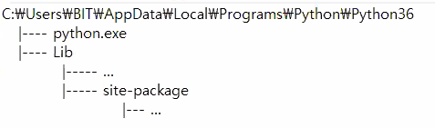
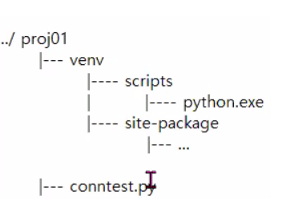
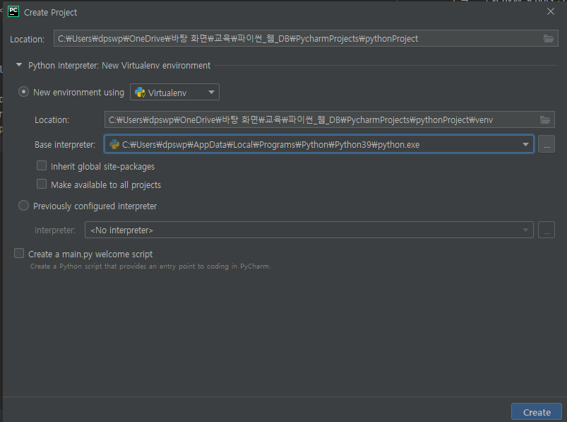
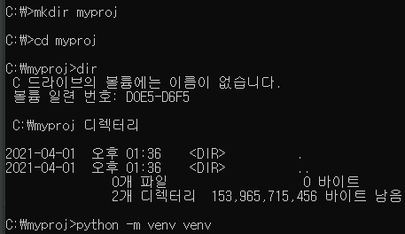
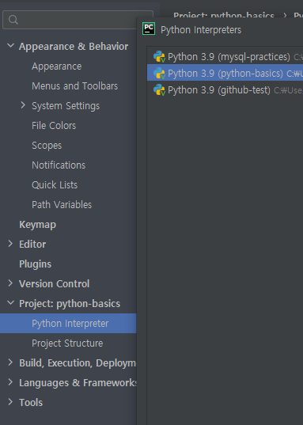
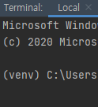

#210401

- 가상환경  
  가상환경을 구축하게 되면  
  프로젝트의 venv에 scripts 안에 python.exe 로 실행  
  그리고 venv에 site-pachage에서 원하는 패키지를 설치  
  이렇게 각각 프로젝트/가상환경에 필요한 패키지만 사용할 수 있음  
  이러면 파이썬 버전이 달라지더라도 괜찮음  
    #사진 1 
   #사진 2 
  이런식으로 설치가 됨 
  

- python Isolation Tools(Virtual Enviroments) [가상환경 도구]
  1. venv : python 3.5 부터 기본으로 제공
  2. virtualenv : python2 부터 사용해오고 있는 가상환경 라이브러리
  3. pyenv : python version manager(파이썬의 여러 버전을 쉽게 관리)에 내장된 가상환경 플러그인
  4. conda : anaconda python을 설치했을 때 사용할 수 있는 가상환경 모듈
  5. ect.......
  

- 파이참에서 create project
  - #사진 3(위) 
  - new environment using 은 가상환경을 사용하겠다는 것. #사진2 참고  
  - base는 중앙에 있는걸 가져오겠다.
  - previously configured interpreter 는 가상환경이 아닌 중앙에 하는거. #사진1 참고

- venv로 virtual 환경 만들기 
   #사진 4 
  - 프로젝트 생성
    - mkdir myproj => myproj 디렉토리 만들기  
    - cd myproj => myproj로 들어가기
  - 가상환경 생성
    - python -m venv venv => 가상환경 생성 이름을 venv로 하는 폴더로 #사진2 처럼 만듬
  - 가상환경 구동
    - source venv\bin\activate (unix 계열)
    - venv\Scripts\activate (windows 계열)
    - 이러고 시작하면 가상환경이 실행됨
  - 가상환경 빠져나오기
    - deactivate

  
-  #사진 5 
  파이참에서 가상환경 설정 확인하기 
-  #사진 6 
  얘네는 가상환경이 실행됨을 알 수 있음
  
=============================
- sqlclient 설치
  터미널에서 
  pip install mysqlclient